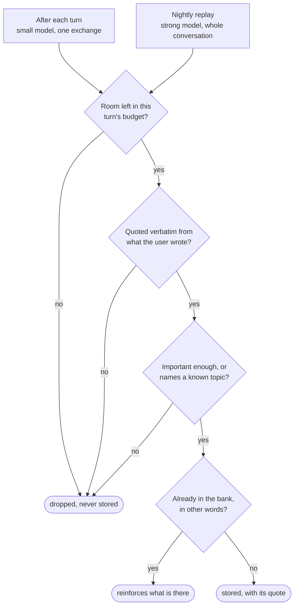
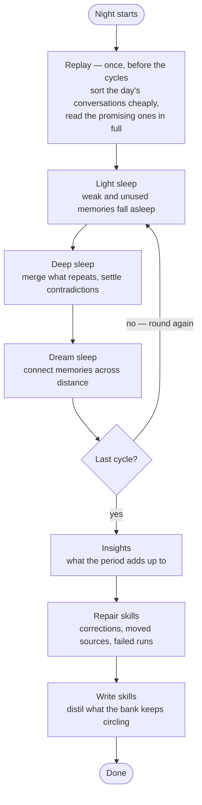

<p align="center">
  
  
</p>

<p align="center">
  <b>A personal AI assistant powered by your existing Claude Code and Codex CLI logins.</b><br>
  Local orchestration and storage. No model API keys required.
</p>

## What Rookery does

Rookery runs the installed `claude` and `codex` CLIs as child processes using their signed-in sessions. It adds persistent memory, an assistant identity, an organization of agents, a task board, schedules, tools, skills, and voice. The web app, terminal, and Telegram share the same core.

The application and database run on your machine. Model requests still go to the selected provider; Telegram, network tools, and server speech engines also use external services. Provider usage follows the account signed in to each CLI.

## Quick start

### Easy Windows installation

Run this in PowerShell. The installer downloads the public repository and sets up Rookery for your Windows user:

```powershell
irm https://raw.githubusercontent.com/jonax1337/rookery-agent/main/scripts/install.ps1 | iex
```

The installer installs Node.js LTS through winget if Node is missing, downloads and builds Rookery, installs its npm package, starts the server, opens the migration/start-fresh choice in Settings, and enables startup after Windows sign-in. Node installation may show the standard Windows approval dialog. No Git or `.env` editing is needed. An existing Node older than 22.5 must be updated first.

If neither provider CLI is installed, the installer offers Codex or Claude Code and opens that CLI's login flow; you can also skip this step. Existing installations and logins are reused. Select your provider in **Settings**. Configure your name, assistant, models, and voice there; configure Telegram in **Gateways**. Default voice needs no key. Add optional OpenAI/ElevenLabs speech keys directly under **Settings → Voice → Speech service keys**.

```powershell
rookery setup           # start, open migration/start-fresh choice, enable autostart
rookery start           # start in the background (safe to repeat)
rookery autostart off   # disable future automatic starts; keep data/current server
rookery autostart on    # enable again
rookery doctor          # check installed provider CLIs and logins
```

Autostart runs as your Windows user **after sign-in**, not before login, and does not keep a sleeping or powered-off PC online. Background startup output goes to `~/.rookery/server.log`. Settings and data stay in `~/.rookery` when the package is upgraded. Disable autostart before `npm uninstall -g rookery-agent`. Re-run setup after moving Node or the installation. On macOS use `rookery setup --no-autostart` or `rookery serve`.

### Linux installation

Requirements: Node.js **22.5+**, npm, curl, and tar. Run as your normal user, without sudo. From a checkout, run `bash scripts/install.sh`. The one-liner is:

```bash
curl -fsSL https://raw.githubusercontent.com/jonax1337/rookery-agent/main/scripts/install.sh | bash
```

The installer builds and installs the package under `~/.local`, offers a provider CLI and login if needed, and opens the migration/start-fresh choice in Settings. No Git or `.env` editing is needed. If `rookery` is not found in a new shell, add `~/.local/bin` to your shell's PATH; the absolute command is `~/.local/bin/rookery`.

With a systemd user session, setup enables `rookery.service` for the **next login**. The initial server runs in the background immediately. The service runs as your user, retaining access to provider logins and the PATH captured during setup. Its unit is stored under `${XDG_CONFIG_HOME:-~/.config}/systemd/user/rookery.service`. After the next login, inspect it with:

```bash
systemctl --user status rookery.service
journalctl --user -u rookery.service
```

For a headless machine that should start the service at boot before login and keep it running after logout, an administrator can enable lingering with `loginctl enable-linger "$USER"`. Setup does not change that system setting. Without systemd, the installer uses `setup --no-autostart`; run `rookery serve` under your existing service manager for automatic startup. `rookery autostart off` disables future starts without stopping the current server; `rookery autostart on` enables them again. Remove autostart before uninstalling with `npm uninstall -g --prefix "$HOME/.local" rookery-agent`.

### npm distribution

The standalone package includes the built web app, server, core, and CLI. No build tools or repository checkout are needed by people installing a release tarball:

```powershell
npm install -g --ignore-scripts ./rookery-agent-0.1.0.tgz; if ($LASTEXITCODE -eq 0) { rookery setup }
```

Maintainers create it with `npm run package` (output: `dist/rookery-agent-0.1.0.tgz`). It is **not yet published to the npm registry**; use a locally built tarball or one shared by the maintainer. The dependencies ship compiled artifacts; skipping install scripts avoids `msedge-tts`'s upstream pnpm-only check. Use a persistent installation for autostart, not an `npx` cache directory.

### From source

Requirements: **Node.js 22.5 or newer** (for `node:sqlite`), npm, and at least one installed, signed-in provider CLI. For Claude Code, run `claude` and `/login`; for Codex, run `codex login`.

```bash
npm install --ignore-scripts
npm run build
npm run doctor
npm start
```

Open <http://127.0.0.1:4317>. The server serves both the API and the built web app.

For background startup and Windows/Linux autostart from a built checkout, run `npm run setup`. Keep that checkout in place while autostart is enabled. The setup/start/autostart commands belong to the standalone launcher; the workspace CLI below provides the terminal commands.

```bash
npm run cli                       # interactive terminal
npm run cli -- chat "Hello"        # one turn
npm run cli -- --plain             # line-based terminal
```

The CLI package declares `rookery` and `rk`. npm links them under `node_modules/.bin`, so examples below work as `npx rookery ...` or `npm run cli -- ...`. Run `npm link -w @rookery/cli` if you want the bare command on your PATH.

The UI and built-in messages are English. New installations use English voice defaults. Existing conversations, memories, agent instructions, and explicitly saved voice settings are preserved. To switch an existing installation's speech, select English and an English voice under **Settings → Voice**; environment overrides also apply on startup.

## Bring your agent from Hermes or OpenClaw

Setup opens **Settings → Migration** (`/settings/migration`). Choose Hermes or OpenClaw, review the detected files and any conflicts, select the individual files and jobs you want, then import. Choose **Start fresh** to keep Rookery's new neutral profile. You can return to Migration later and edit the Markdown files under **Settings → Identity**.

Rookery preserves identity, personality, user knowledge, and Markdown memory in its assistant workspace: `IDENTITY.md`, `SOUL.md`, `USER.md`, `AGENTS.md`, `TOOLS.md`, `MEMORY.md`, and `memory/`. Imported instructions use Rookery's tools and permissions; source files stay untouched. Replaced files are backed up. Sessions, credentials, services, and executable skills are not automatically transferred.

Compatible recurring cron jobs transfer as **paused schedules** for review. Five-field cron expressions with assistant text prompts, Hermes script bundles and remaining repeat counts are supported; unsupported timings and execution features appear in the migration warnings. Review permissions, tools, and delivery in **Schedules** before enabling them. Script jobs require source review and an explicit Full access grant before execution.

The standalone launcher also supports a local preview and explicit import:

```bash
rookery migrate hermes
rookery migrate openclaw --from /path/to/openclaw/workspace
rookery migrate hermes --from /path/to/hermes/profile --apply
```

Without `--apply`, no source files are imported. From a built checkout use `node scripts/rookery.mjs migrate ...`. See [migration and portable identity](docs/migration.md) for source paths, file mappings, backups, and limitations. Preserving persona and knowledge does not guarantee identical answers across models and harnesses.

## Web app

| Area | What you can do |
|---|---|
| Chat and Conversations | Stream replies, resume conversations, filter by counterpart/project, inspect transcripts, and archive conversations |
| Dashboard | Inspect totals and activity trends from `GET /api/stats` |
| Tasks | Create, plan, run, finish, and cancel task-board entries |
| Assignments | Follow agent runs, progress, reports, and failures |
| Schedules | Configure recurring jobs, run them manually, and inspect history |
| Gateways | Configure Telegram, controller IDs, pairing, and push notifications live |
| Organization | Manage agents, teams, and projects |
| Memory | Browse memories, explore their 3D graph, and inspect sleep runs |
| Tools and Skills | Configure MCP servers and create, edit, or import instructions |
| Settings | Import a Hermes/OpenClaw profile, edit identity Markdown, and configure providers, memory, voice, and runtime options |

The sidebar provides navigation, new conversation and voice actions, connection status, and search (`Ctrl+K`). Summary totals come from database counts, not capped list responses. Cards based on a limited list describe that basis.

## Telegram gateway

Configure Telegram under **Gateways → Telegram** (`/gateways/telegram`):

1. Create a bot with [BotFather](https://t.me/BotFather).
2. Enter its token, enable the gateway and pairing, and save.
3. Send `/id` to the bot in a private chat.
4. Add the returned numeric user ID to allowed controllers. Adding a controller closes pairing.
5. Save the controller list. Changes apply without restarting the server.

Only allowed user IDs can control the assistant. Group chats and bot senders are rejected. Pairing identifies a controller; it does not grant access to chat or tools. An empty allowlist grants no control access.

Telegram uses long polling, so no public webhook is required. Each controller gets a separate gateway conversation. Check the gateway permission setting when enabling the bot: its built-in default is `full`.

Use `/start` for commands, `/new` for a fresh conversation, `/stop` to interrupt a turn, and `/status` for current state. `/off` stops the entire Telegram gateway, including push delivery and active turns, until the server process restarts. Earlier `/neu` and `/aus` commands remain accepted. To disable only push messages, use the gateway's push setting. Push settings cover mail addressed to you, assignments, schedules, sleep runs, and optional task updates, with quiet hours, recipient selection, and an hourly cap. Mail is what a new install pushes: the company reports to you in company mail, and the phone carries that mail instead of a message per finished run. Who is worth a push is its own setting — the assistant alone, the assistant plus the agents leading a team, or everyone.

The token is stored in local configuration; browser config responses expose whether a token is set rather than returning the secret. Keep the Rookery home directory private. See [the gateway design document](docs/concepts/telegram-channel.md) for background.

## Architecture and turn flow

```text
packages/core     Providers, memory, persona, runtime, organization, computer tools.
                  No HTTP server or terminal UI dependencies.
packages/server   Fastify REST, WebSocket, SSE, static hosting, TTS, gateways.
packages/cli      Commander commands, Ink TUI, plain REPL, operating-system speech.
packages/web      React + Vite, assistant-ui, shadcn and shared page templates.
```

A turn recalls memories, builds context with identity and organization/inbox information, streams the provider CLI, stores the exchange, and starts background memory extraction. Assignments and tool activity arrive as events alongside the answer. Learning runs after the answer.

If the assistant enables a previously unavailable MCP tool server during a turn, the runtime can resume the provider once with updated tools. Output is combined into the same turn, bounded to two passes.

The assistant's working directory defaults to **`~/.rookery/workspace`**, independently of the launch directory. `ROOKERY_HOME` relocates the default workspace; `ROOKERY_WORKSPACE` or configuration can override it. Rookery creates workspace instructions when absent. Agents use their assigned project directories, or a separate `~/.rookery/agent-workspaces/<agent-id>` directory when no project is selected. This selects the working directory; it is not a filesystem isolation guarantee.

The assistant keeps its configured identity. You can start a separate direct conversation with an agent using `--agent` or `/talk`; an existing conversation keeps its counterpart. Switching provider starts a new provider conversation where necessary.

### Provider authentication

The adapters launch real CLIs and consume their JSON streams:

```text
claude -p --output-format stream-json --verbose --include-partial-messages
codex exec [resume <id>] --json --skip-git-repo-check --color never -s <sandbox>
```

They use existing CLI authentication and native session IDs (`--resume` or `codex exec resume`). Model access requires no API-key setting in Rookery. Optional OpenAI and ElevenLabs **speech** engines are separate: their keys are configured in Settings → Voice and kept on the server.

Claude runs with `--setting-sources ""`. When Rookery supplies MCP servers, it also passes `--mcp-config` and `--strict-mcp-config`. Rookery replaces the coding system prompt for the assistant; project agents retain their coding role. A `CLAUDE.md` in the selected working directory can still be read by Claude.

### Permission levels

| Level | Claude Code | Codex |
|---|---|---|
| `chat` | `--restricted` and additional read/search/task tools blocked | `read-only` sandbox |
| `read` | `--restricted`; edit/write/notebook-edit tools blocked | `read-only` sandbox |
| `write` | `--restricted --permission-mode acceptEdits` | `workspace-write` sandbox |
| `full` | `--dangerously-skip-permissions` | `danger-full-access` sandbox |

The default agent permission is `read`; agents can override it. Claude's restricted levels disable shell access, while Codex uses its sandbox rather than the same tool restrictions. The assistant's MCP bridge and gateway policy impose their own boundaries. Prompt instructions to ask before irreversible actions do not replace those controls.

## Memory

Rookery combines portable Markdown knowledge in the assistant workspace (`USER.md`, `MEMORY.md`, and `memory/`) with its existing structured memory in `~/.rookery/rookery.db`. Identity and core Markdown knowledge are loaded for assistant turns; detailed Markdown notes can be retrieved through the assistant's Rookery MCP profile tools. The SQLite bank uses built-in `node:sqlite` without a native database build step. Its kinds are `fact`, `preference`, `project`, `event`, `summary`, and sleep-generated `insight`.

Extraction proposes durable memories; a gate decides what is written. **A candidate must quote the words it stands on, and those words must appear in what the user actually wrote** — the assistant's own answer does not count as a source, so a conclusion it reached itself is never stored as something the user said. Anything that cannot be quoted is dropped unstored. The quote is kept on the record and shown in the memory inspector, so a claim stays checkable long after the conversation is gone. Agents follow the same rule against the assignment and the report they were given.

Beyond that the gate limits candidates (three per turn by default), filters low-importance candidates without known entities, and reinforces near-duplicates instead of inserting another copy. Comparison is lexical throughout, not embeddings: a quote is matched as unbroken runs of normalised words, so a smoothed quotation passes and one assembled from scattered words does not.



Memories added by hand carry no quote and are not subject to the rule; they are also protected from everything the nightly run does.

Recall combines FTS5/BM25 relevance (0.55), importance (0.20), recency (0.15, with a 30-day half-life), and usage (0.10), plus tag matches. A core profile adds pinned memories, insights, and selected important facts independently of the query. Graph expansion follows shared entities and selected edges. Results include reasons such as `strong text match` or `high importance`.

Each agent has its own memory owner; agent recall does not expose the assistant's personal bank. The graph connects memories to entities and other memories through `refines`, `supersedes`, `contradicts`, `caused_by`, and `co_occurs` edges. The graph is lazy-loaded and requires WebGL; the memory list remains available separately.

```bash
rookery memory list
rookery memory add "I prefer concise replies." --kind preference --importance 0.9
rookery memory search deployment
rookery memory forget <id>             # soft-delete
rookery memory forget <id> --hard      # permanent deletion
rookery memory stats
```

### Sleep

The server creates a normal `sleep` schedule, defaulting to **03:30 in the server's local time**. It can be disabled or run manually. The server must be running for schedules to execute.

A night opens by going back over the day, then runs cycles of light sleep (strength bookkeeping and dormancy), deep sleep (merging and resolving contradictions), and dream sleep (connections and insights). Defaults are two cycles and Sonnet for merging, insights and skill work; limits and models are configurable under `memory.sleep`.



**Replay** exists because the per-turn extractor sees one exchange at a time through a small model, so whatever only becomes visible across a whole conversation is out of its reach. At night the transcripts are read again without that constraint. Cost is contained by sorting first: a cheap pass sees only the user's turns, heavily clipped, and answers whether anything durable is likely to be there; only what survives is read in full. A conversation with fewer than two user turns costs no model call at all. The evidence rule is not relaxed — the night must quote the user exactly as the day does. `memory.sleep.replaySessions` caps the deep reads per night (twelve by default).

**Skill work** runs last, and repair before invention: a stale procedure misleads whoever opens it next, which is worse than one that was never written. Three signals mark a skill for revision — a correction the replay found in the day's conversations, a source memory that was superseded, retired or edited, and a run that had the skill open and then failed, with its error text. Looking at a signal consumes it, so one dormant memory cannot present the same skill night after night.

Dormant memories remain in the database and can be woken. Sleep does not retire user-authored or pinned memories, and never overwrites a skill a person wrote; conflicts between two protected memories remain for the user to decide. Undo wakes memories marked dormant by the run, removes the memories and edges it generated — including what its replay harvested — and restores any skill it wrote or rewrote from the snapshot taken beforehand. It is not a database snapshot: entity updates and deleted pre-existing contradiction edges are not restored. Cancelling a run keeps changes already completed. See [the sleep design document](docs/concepts/memory-graph-and-sleep.md) and [the evidence and self-written skills document](docs/concepts/confirmed-memory-and-self-written-skills.md), with code as the source of current behavior.

## Organization, tasks, and assignments

| Term | Meaning |
|---|---|
| Agent | Persistent role, instructions, provider/model, permission, team, manager, and separate memory |
| Team | Group of agents with a purpose and optional lead |
| Project | Work context with an optional directory for assignments |
| Assignment | One agent run with progress, report, status, and duration |
| Task | Board entry planned and executed as one or more assignments |
| Message | Communication between agents, managers, and the assistant |

A persistent agent is a stored role, not a permanently running provider process. Assignments launch fresh CLI processes. Delegation follows reporting relationships and is bounded by depth and concurrency limits. Defaults are four concurrent assignments, depth three, and a 45-minute timeout per assignment.

```bash
rookery org
rookery org hire --name Mara --title "Backend Engineer" --instructions "Maintain the server."
rookery org projects add Example --path /path/to/project
rookery assign mara "Describe the server routes" --project Example
rookery org assignments
rookery --agent mara
rookery tasks add "Write release notes"
rookery tasks plan <id>
rookery tasks run <id>
```

Use `rookery org --help`, `rookery tasks --help`, and `/help` for the full command set. The TUI shows streamed output, tool calls, live assignment rows, reported usage, and a slash-command palette. `Ctrl+C` interrupts a turn and exits when idle; `Ctrl+D` exits. Pipes, `TERM=dumb`, `ROOKERY_TUI=0`, or `--plain` use the line-based REPL.

## Tools and skills

**Tools** (`/tools`, `rookery tools`) are MCP servers configured for the assistant, agents, or both. The catalog includes computer control and browser tooling; availability depends on platform and installed server. Some servers start on demand through `npx`. Custom servers can be configured in the UI.

Rookery's organization and memory tools use its per-turn MCP bridge; the tool hub attaches additional MCP servers directly to each provider process for the configured audience. Provider-native tools are governed by the permission flags above, so MCP-only execution is a design intent, not a universal enforced guarantee. Toggles apply to subsequent provider processes, including the bounded second pass described above. Showing tool calls in web chat is a browser-local preference.

**Skills** (`/skills`, `rookery skills`) are folders under `~/.rookery/skills`, each containing a `SKILL.md` with name, description, audience and origin metadata, plus supporting files. Rookery advertises the catalog in context; `use_skill` loads instructions and the file list.

Skills arrive three ways. You can author them in the UI or import them from GitHub using a repository path or URL. The assistant and its agents can write one themselves with `write_skill` when a procedure turns out to recur. And the nightly run distils one out of what the memory keeps circling, then keeps it up to date as described under [Sleep](#sleep). The `origin` field records which of the three wrote the current text (`user`, `agent`, `sleep`), and the Skills page shows it.

Two rules bound the unattended paths: **a skill you wrote is never overwritten** — the store refuses and the night logs the refusal — and every unattended write keeps the previous `SKILL.md` first, so undoing the night that made it puts the old text back. Skills written during an assignment always land in the home directory, never in a project's own `.claude/skills`. Editing a night-written skill in the UI makes it yours, which also protects it from further rewriting.

`use_skill` returns instructions and a file list; it does not execute scripts. Running a script requires an available execution tool and its permissions. Project-scoped skill/MCP proposals under `docs/concepts` should not be assumed fully implemented.

## Voice

The full-screen `/voice` page uses its own voice conversation. Tap the orb to begin, speak, and hear streamed replies. The orb reflects microphone, thinking, and speaking activity. Space or the orb interrupts, `M` toggles the microphone, and Escape exits. Wake-word detection and barge-in are optional. A saved voice conversation can be resumed from its transcript.

Voice turns request concise, speech-friendly replies without Markdown or code blocks. The `jarvis` style adds a composed butler register; `neutral` disables it. The optional browser audio effect adds EQ, compression, and a short room effect. Background assignment completion can be announced after the spoken turn ends.

| Engine | Configuration |
|---|---|
| Edge (default) | Server `msedge-tts`; no API key; new default `en-GB-RyanNeural` |
| ElevenLabs | Key and voice selection in Settings → Voice |
| OpenAI | Key in Settings → Voice; `gpt-4o-mini-tts` |
| Browser | Browser `speechSynthesis`; also used when server speech fails |

New installations use `voice.lang = "en-GB"`. Existing configured languages and voices remain selected. Browser recognition depends on browser support and microphone permission; the UI reports when unavailable. Chat supports push-to-talk dictation.

The CLI uses OS speech: PowerShell `System.Speech` on Windows, `say` on macOS, and `spd-say` or eSpeak on Linux. Server TTS: `POST /api/tts` with `{ "text": "Hello" }`; `GET /api/tts/voices` lists capabilities.

## Configuration

Optional speech keys can be saved, replaced, or removed under **Settings → Voice → Speech service keys** without a restart. They are stored in `~/.rookery/voice-keys.json`, separately from assistant configuration, and API responses expose only their status. This is a local plaintext file: keep the Rookery home private. Saved keys take precedence over legacy `OPENAI_API_KEY` / `ELEVENLABS_API_KEY` environment values; removing a saved key restores that environment fallback. Empty password fields leave existing keys unchanged.

The default file is `~/.rookery/config.json`. Startup precedence:

```text
built-in defaults → config.json → environment → explicit invocation overrides
```

The server entry point first loads `<ROOKERY_HOME>/.env` (default `~/.rookery/.env`), then the checkout root's `.env`, resolved relative to the server module. Existing shell variables win; values from the home file take precedence over the checkout file. The loader supports simple `KEY=value` lines without interpolation. See [`.env.example`](.env.example). Direct CLI commands read their process environment and saved configuration; they do not run this `.env` loader.

Settings, runtime tool toggles, and the assistant's `update_settings` tool share the configuration update path. Changes are saved to `config.json` and applied to the shared runtime object. Startup overrides such as `--port` remain until explicitly changed and are not silently persisted. Resetting an optional value removes its saved override.

Example configuration fragment:

```json
{
  "assistantName": "Rookery",
  "defaultProvider": "claude",
  "defaultPermission": "read",
  "voice": {
    "lang": "en-GB",
    "engine": "edge",
    "edgeVoice": "en-GB-RyanNeural",
    "style": "jarvis"
  },
  "org": {
    "maxConcurrentAssignments": 4,
    "maxDelegationDepth": 3,
    "assignmentTimeoutMs": 2700000
  }
}
```

Use the UI or `rookery config get`, `rookery config set <key> <value>`, and `rookery config path`. Complete defaults/types: [`config.ts`](packages/core/src/config.ts) and [`types.ts`](packages/core/src/types.ts).

### Remote access

The server binds to `127.0.0.1` by default. With an empty `ROOKERY_TOKEN`, API access is unauthenticated; binding another host does **not** automatically enable authentication. Set a strong shared token before exposing the server beyond loopback.

```powershell
$env:ROOKERY_HOST = '0.0.0.0'
$env:ROOKERY_TOKEN = '<your-long-random-secret>'
npm start
```

API clients send `Authorization: Bearer <token>`. Browser WebSockets use the token query parameter. This is a shared-token model, not individual user accounts. Telegram controller IDs are a separate policy.

## Development and checks

```bash
npm run build
npm run dev:all
```

The combined script starts the built server plus Vite at <http://localhost:5317>. It does not watch or restart the backend: rebuild and restart after backend changes. For automatic backend restarts, run `npm run dev` alongside the core/server package `watch` commands. Vite proxies to `http://127.0.0.1:4317` by default; set `ROOKERY_BACKEND` when the backend uses another address.

| Command | Purpose |
|---|---|
| `npm run build` | Build core, server, CLI, and web in order |
| `npm run build:core` | Build core only |
| `npm run typecheck` | TypeScript project build/check for core, server, CLI |
| `npm test` | Core tests |
| `npm test -w @rookery/server` | Server integration tests |
| `npm test -w @rookery/web` | Web utility and table tests |
| `npm run tui:check -w @rookery/cli` | Render terminal components and check output |
| `npm run tui:drive -w @rookery/cli` | Drive the terminal with stubbed provider events |
| `npm run dev:web` | Vite development server only |
| `npm run doctor` | Provider readiness and setup diagnostics |
| `npm run setup` | Start in the background, open Settings, and enable Windows/Linux autostart |
| `npm run package` | Build and pack the standalone npm tarball into `dist` |
| `npm run test:install` | Check installer arguments and Windows/Linux autostart configuration |
| `npm run clean` | Remove build artifacts |

Build before tests that import `dist` output. The web build includes its own TypeScript check. Keep package boundaries intact and reuse `components/shell`, `components/blocks`, and `components/common` for pages. Built-in user-facing text is English.

## Troubleshooting

| Symptom | Check |
|---|---|
| No provider ready | Install/sign in to a CLI and run `npm run doctor` |
| Web app offline | Start server and check host, port, and token |
| First turn is slow | CLI startup and prompt processing add latency |
| No microphone response | Check recognition support and permission |
| Speech still German after updating | Change saved language/voice and check environment overrides |
| Telegram ignores messages | Use a private chat; check allowed ID, token, pairing, and status |
| `dev:all` exits immediately | Run `npm run build` first |
| API works but web app is missing | Build `@rookery/web`; server supports API-only operation |

## Design documents

[`docs/concepts`](docs/concepts) contains design history and proposals, some partly implemented. They may retain their original German text; current behavior is determined by code. Topics: [agent performance](docs/concepts/agent-performance-management.md), [memory and sleep](docs/concepts/memory-graph-and-sleep.md), [evidence-backed memory and self-written skills](docs/concepts/confirmed-memory-and-self-written-skills.md), [project-scoped skills and MCP](docs/concepts/project-scoped-skills-and-mcp.md), and [Telegram](docs/concepts/telegram-channel.md).

## License

MIT. See [`LICENSE`](LICENSE).
